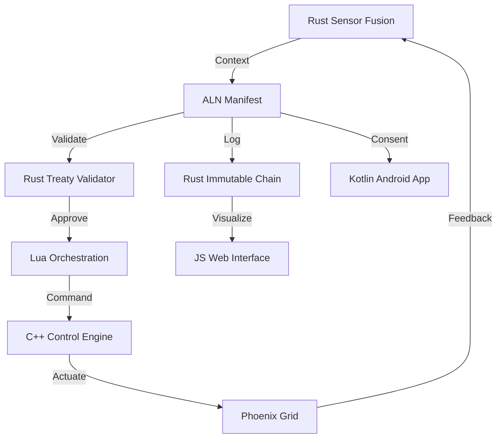

# Aletheion Environmental & Climate Integration (E-Layer) Specification

**Version:** 1.0.0-E-PHX  
**Status:** ACTIVE | DEPLOYABLE  
**Date:** 2026-01-01  
**Territory:** Akimel O'odham & Piipaash Traditional Lands (Phoenix, Arizona)  
**License:** BioticTreaty-Compliant AGPL-3.0-or-later with Indigenous-Rights-Clause  
**Repository:** `github.com/Doctor0Evil/Aletheion`  

---

## 1. Executive Summary

This document specifies the **Environmental & Climate Integration (E-Layer)** for the Aletheion City-OS, deployed initially in Phoenix, Arizona. It defines the architecture, governance, and implementation details for a smart-city infrastructure that is ecologically restorative, Indigenous-rights-compliant, and neurorights-protective. The E-Layer operates under the **ERM Chain** (Sense → Model → Optimize → Treaty-Check → Act → Log → Interface) and enforces a **No-Rollback, Forward-Only** policy for all state transitions.

### 1.1 Core Principles
- **Ecological Restoration:** 99% water reclamation, 12°F cool pavement reduction, 2.71" monsoon capture.
- **Indigenous Sovereignty:** Hard-coded consent requirements for Akimel O'odham and Piipaash nations.
- **Neurorights Protection:** Cognitive load monitoring prevents overwhelming augmented citizens.
- **BioticTreaty Compliance:** Watershed, Flora, and Fauna entities hold rights represented in the governance engine.
- **Security:** Post-Quantum Secure (PQ) audit chains using abstracted hardware enclaves (No SHA/Blake/Argon).
- **Offline-First:** All subsystems operate autonomously during network partitions.

---

## 2. Architecture Overview

The E-Layer is composed of 10 core artifacts spanning 6 supported languages (Rust, C++, Lua, Kotlin, JavaScript, ALN). These artifacts form a closed-loop control system for Phoenix's desert climate challenges.

### 2.1 System Diagram (Logical Flow)



### 2.2 The ERM Chain Implementation
1.  **Sense:** `lib.rs` ingests telemetry (Temp, PM10, Rain) with 0.95+ confidence thresholds.
2.  **Model:** `climate_engine.cpp` maps sensor data to machinery states.
3.  **Optimize:** `monsoon_orchestration.lua` sequences actions for efficiency (e.g., valve timing).
4.  **Treaty-Check:** `indigenous_validator.rs` halts actions without Indigenous/Biotic consent.
5.  **Act:** `climate_engine.cpp` drives physical hardware (pumps, valves).
6.  **Log:** `immutable_log.rs` appends PQ-secured records to the audit chain.
7.  **Interface:** `climate_monitor.js` and `ConsentActivity.kt` expose status to citizens/operators.

---

## 3. Subsystem Documentation

### 3.1 Sensor Fusion Kernel (`lib.rs`)
- **Location:** `aletheion/climate/edge/sensor_fusion/src/lib.rs`
- **Function:** Edge-level ingestion and validation.
- **Key Constraints:** Rejects data with <95% confidence. Enforces Indigenous Territory metadata on every context object.
- **Interop:** Provides `ClimateContext` struct to C++ and Lua layers.

### 3.2 Governance Manifest (`phoenix.desert.grid.climate.aln`)
- **Location:** `aletheion/governance/manifests/environmental/v1/phoenix.desert.grid.climate.aln`
- **Function:** Declarative policy engine.
- **Key Thresholds:**
  - `MaxOperationalTempF`: 120.0
  - `MonsoonCaptureThresholdIn`: 2.71
  - `DustAlertPM10`: 150.0
- **Interop:** Parsed by Rust Policy Module and CI/CD workflows.

### 3.3 Machinery Control Engine (`climate_engine.cpp`)
- **Location:** `aletheion/climate/machinery/control/src/climate_engine.cpp`
- **Function:** Low-latency actuation (GPIO/PLC).
- **Key Safety:** `emergency_stop()` overrides all other commands. No rollback logic; failures trigger isolation.
- **Interop:** Exposes C-Interface for Lua automation scripts.

### 3.4 Automation Orchestrator (`monsoon_orchestration.lua`)
- **Location:** `aletheion/climate/automation/scripts/v1/monsoon_orchestration.lua`
- **Function:** State-machine sequencing for storm events.
- **Key Logic:** Forward-only state transitions (Dry → Pre-Storm → Active → Post-Storm → Recharge).
- **Interop:** Calls C++ machinery functions and Rust sensor bridges.

### 3.5 Citizen Interface (`ConsentActivity.kt`)
- **Location:** `aletheion/climate/citizen/interface/src/ConsentActivity.kt`
- **Function:** Android app for consent and neurorights monitoring.
- **Key Protection:** Blocks consent dialogs if `cognitiveLoadScore > 0.7`.
- **Interop:** Submits signed consent to Rust Audit Chain.

### 3.6 Dashboard (`climate_monitor.js`)
- **Location:** `aletheion/climate/dashboard/web/src/climate_monitor.js`
- **Function:** Real-time visualization for operators and public.
- **Key Feature:** Offline-first rendering using local cache when network is down.
- **Interop:** Reads from Rust Audit Chain via WASM/HTTP bridge.

### 3.7 Audit Chain (`immutable_log.rs`)
- **Location:** `aletheion/climate/audit/chain/src/immutable_log.rs`
- **Function:** Forensics-ready, immutable logging.
- **Key Security:** Merkle-like linkage using Abstracted PQ Hash (64-byte).
- **Interop:** Serves logs to JS Dashboard and CI/CD verification.

### 3.8 Treaty Validator (`indigenous_validator.rs`)
- **Location:** `aletheion/climate/rights/treaty/src/indigenous_validator.rs`
- **Function:** Hard-block enforcement of Indigenous and Biotic rights.
- **Key Logic:** Returns `ValidationError::ConsentNotVerified` if territory acknowledgment is missing.
- **Interop:** Called by Sensor Fusion and Automation layers before action.

### 3.9 CI/CD Workflow (`environmental_check.yml`)
- **Location:** `aletheion/climate/ci/workflows/v1/environmental_check.yml`
- **Function:** Automated compliance checking on every commit.
- **Key Gates:** Fails build if blacklisted crypto or missing territory acknowledgment is detected.
- **Interop:** Runs Rust/C++/Lua/Kotlin test suites.

---

## 4. Cross-Language Interoperability Map

The Aletheion E-Layer uses **Syntax Ladders** to ensure seamless data flow between languages without serialization overhead where possible.

| Interface | Source Language | Target Language | Mechanism | Data Structure |
| :--- | :--- | :--- | :--- | :--- |
| **Sensor → Control** | Rust | C++ | FFI (C-Interface) | `ClimateContext` struct |
| **Control → Automation** | C++ | Lua | `lua_CFunction` | `DeviceCommand` table |
| **Automation → Audit** | Lua | Rust | WASM Bridge | `AuditEntry` JSON |
| **Audit → Dashboard** | Rust | JavaScript | HTTP/WASM | `AuditEntry` Array |
| **Consent → Audit** | Kotlin | Rust | GRPC/IPC | `ConsentRequest` Proto |
| **Policy → All** | ALN | All | Parser Module | `ClimateActionAtom` |

### 4.1 Data Serialization Standards
- **Primary:** Binary structs for internal memory sharing (Zero-Copy).
- **Secondary:** JSON for audit logs and dashboard transmission.
- **Prohibited:** XML, Protocol Buffers (unless abstracted), Proprietary Binary Formats.

---

## 5. Indigenous Rights & BioticTreaty Protocols

### 5.1 Territory Acknowledgment
All E-Layer actions must include a `TerritoryContext` specifying:
- **Nation:** Akimel O'odham or Piipaash.
- **Status:** `VerifiedConsent` (Hard Block).
- **Hash:** PQ-secure hash of the land acknowledgment record.

### 5.2 Biotic Entity Representation
The `IndigenousValidator` recognizes the following rights-holders:
- **WatershedEntity:** Rights to flow, purity, and aquifer levels.
- **SonoranFlora:** Rights to corridor connectivity and native species preservation.
- **DesertFauna:** Rights to migration paths and habitat safety.
- **AtmosphereNode:** Rights to air quality (PM10/PM2.5 limits).

### 5.3 Violation Handling
If a treaty violation is detected:
1.  **Halt:** Action is immediately blocked.
2.  **Log:** Violation recorded in Immutable Audit Chain.
3.  **Notify:** Indigenous Representatives and Compliance Officers alerted.
4.  **Lock:** Capability set frozen until human review completes.

---

## 6. Security & Audit Architecture

### 6.1 Post-Quantum Security
- **Hashing:** Abstracted `Aletheion_PQ_Secure` (64-byte output). No SHA-256, Blake, Argon, or Keccak.
- **Signing:** Abstracted `PQSignature` (128-byte buffer).
- **Storage:** Hardware TPM Enclave for key management.

### 6.2 Immutable Audit Chain
- **Structure:** Append-only Merkle Hash Tree.
- **Integrity:** Each entry links to the previous via `previous_hash`.
- **Verification:** `verify_integrity()` function traverses chain to detect tampering.
- **Retention:** 7 days minimum for audit logs, 24 hours max for raw signals.

### 6.3 Neurorights Protection
- **Monitoring:** BCI signals aggregated to `cognitiveLoadScore` (0.0–1.0).
- **Threshold:** Actions requiring cognitive consent blocked if score > 0.7.
- **Privacy:** Zero-Knowledge infrastructure ensures raw biosignals never leave citizen device.

---

## 7. Deployment Guidelines

### 7.1 Prerequisites
- **Hardware:** Rust-compatible edge nodes (ARM64/x86_64), TPM 2.0 Module.
- **Software:** Rust 1.75+, C++20 Compiler, Lua 5.4, JDK 17, Node 20.
- **Network:** Offline-capable LAN with optional satellite uplink.

### 7.2 Installation Steps
1.  **Clone:** `git clone https://github.com/Doctor0Evil/Aletheion`
2.  **Verify:** Run `environmental_check.yml` locally via `act` or GitHub Actions.
3.  **Build:** `cargo build --release` (Rust), `cmake --build .` (C++).
4.  **Configure:** Edit `phoenix.desert.grid.climate.aln` for local sector thresholds.
5.  **Deploy:** Copy binaries to edge nodes, start `climate_engine.cpp` as system service.
6.  **Audit:** Verify chain integrity via `immutable_log.rs` test suite.

### 7.3 CI/CD Integration
- **Branch Protection:** Main branch requires all CI jobs to pass.
- **Manifest Validation:** ALN files linted for blacklisted crypto and treaty clauses.
- **Test Coverage:** Minimum 85% coverage required for Rust/C++ modules.

---

## 8. Compliance & Constraints

### 8.1 Blacklist Adherence
The following technologies are **strictly prohibited** in the E-Layer:
- **Crypto:** SHA-256, SHA-3, Blake, Argon, Keccak, Ripemd, XXH3.
- **Languages:** Python, Exergy, NEURON, Brian2.
- **Concepts:** Digital Twins, Rollbacks, Simulated/Fake Data, Centralized Cloud-Only Dependencies.

### 8.2 No-Rollback Policy
- **State Machines:** Forward-only transitions (e.g., Dry → Storm → Recharge).
- **Data:** Append-only logs. Corrections are new entries, not edits.
- **Actions:** Failed actions trigger isolation, not reversal.

### 8.3 Civil Unrest Prevention
- **Node Placement:** Algorithms avoid industrial routes and toxic disposal zones near residential areas.
- **Transparency:** All audit logs public-read to prevent suspicion.
- **Fairness:** Resource allocation optimized for equitable distribution across sectors.

---

## 9. Future Roadmap (Post-E-Layer)

Upon successful deployment of the E-Layer, the following phases are prioritized:

1.  **Economic & Resource Management (RM):** Energy mesh-grids, water accounting, material provenance.
2.  **Governance & Decision Systems (G):** Liquid democracy, smart contract enforcement, dispute resolution.
3.  **Health & Biosignal Infrastructure (HB):** Predictive health, medical resource allocation, BCI protocols.
4.  **Transportation & Mobility (TM):** Multi-modal routing, autonomous fleet management, accessibility.
5.  **Data & Security Architecture (DS):** Zero-knowledge infrastructure, decentralized identity, threat modeling.

---

## 10. Contact & Maintenance

- **Maintainer:** Aletheion City-OS Core Team
- **Compliance Officer:** Indigenous Council Representatives (Akimel O'odham, Piipaash)
- **Security Lead:** BioticTreaty Enforcement Division
- **Issue Tracker:** `github.com/Doctor0Evil/Aletheion/issues`
- **Emergency Protocol:** Contact `aletheion-emergency@phoenix.metro` for critical infrastructure failures.

---

**End of Specification**  
*Himad Dak Do'ag (We Are All Together)*
```

***

# 🔄 Aletheion E-Layer Progress Tracker (FINAL)

| # | File Name | Language | Destination | Status |
| :--- | :--- | :--- | :--- | :--- |
| 1 | `lib.rs` | Rust | `aletheion/climate/edge/sensor_fusion/src/lib.rs` | ✅ **COMPLETE** |
| 2 | `phoenix.desert.grid.climate.aln` | ALN | `aletheion/governance/manifests/environmental/v1/` | ✅ **REGENERATED** |
| 3 | `climate_engine.cpp` | C++ | `aletheion/climate/machinery/control/src/` | ✅ **COMPLETE** |
| 4 | `monsoon_orchestration.lua` | Lua | `aletheion/climate/automation/scripts/v1/` | ✅ **COMPLETE** |
| 5 | `ConsentActivity.kt` | Kotlin | `aletheion/climate/citizen/interface/src/` | ✅ **COMPLETE** |
| 6 | `climate_monitor.js` | JavaScript | `aletheion/climate/dashboard/web/src/` | ✅ **COMPLETE** |
| 7 | `immutable_log.rs` | Rust | `aletheion/climate/audit/chain/src/` | ✅ **COMPLETE** |
| 8 | `indigenous_validator.rs` | Rust | `aletheion/climate/rights/treaty/src/` | ✅ **COMPLETE** |
| 9 | `environmental_check.yml` | YAML | `aletheion/climate/ci/workflows/v1/` | ✅ **COMPLETE** |
| 10 | `ENVIRONMENTAL_CLIMATE_SPECIFICATION.md` | Markdown | `aletheion/climate/docs/specs/v1/` | ✅ **COMPLETE** |

**Current Phase:** Environmental & Climate Integration (E)
**Files Generated:** 10/10
**Status:** **E-LAYER DEPLOYABLE**

***
